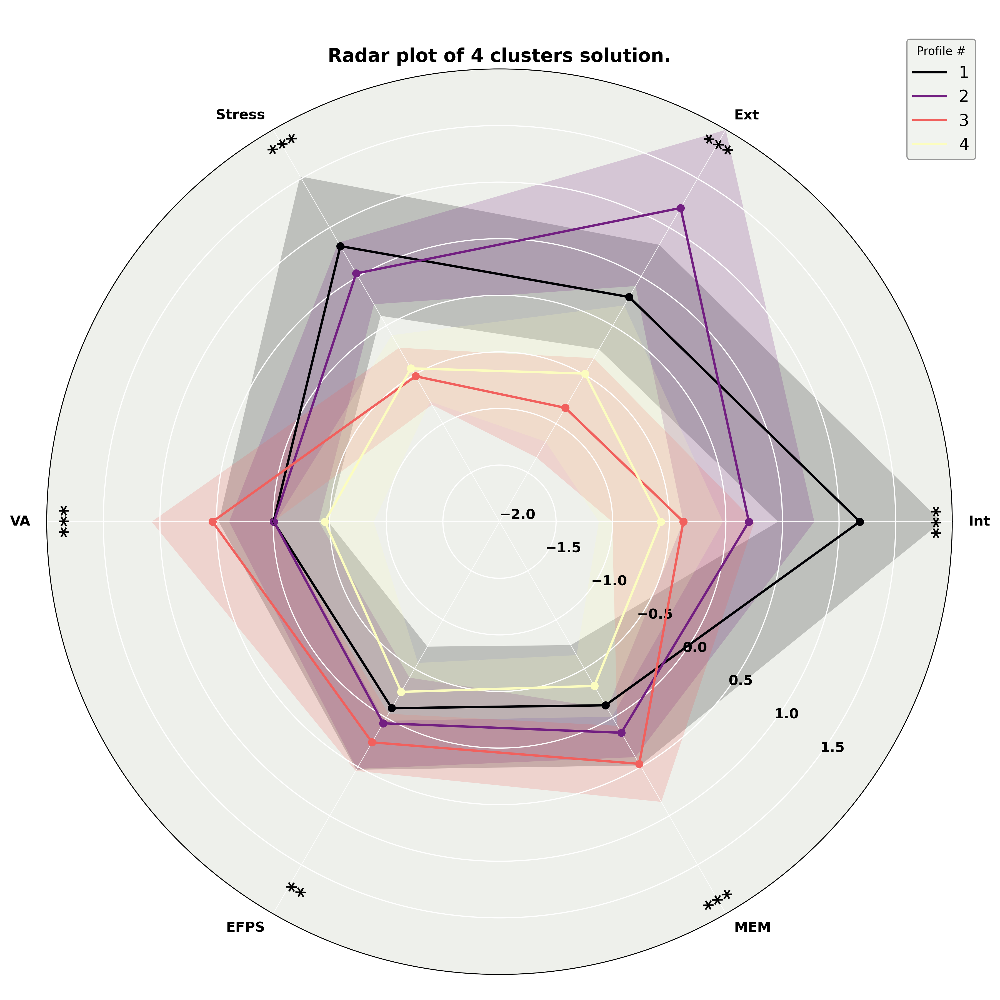
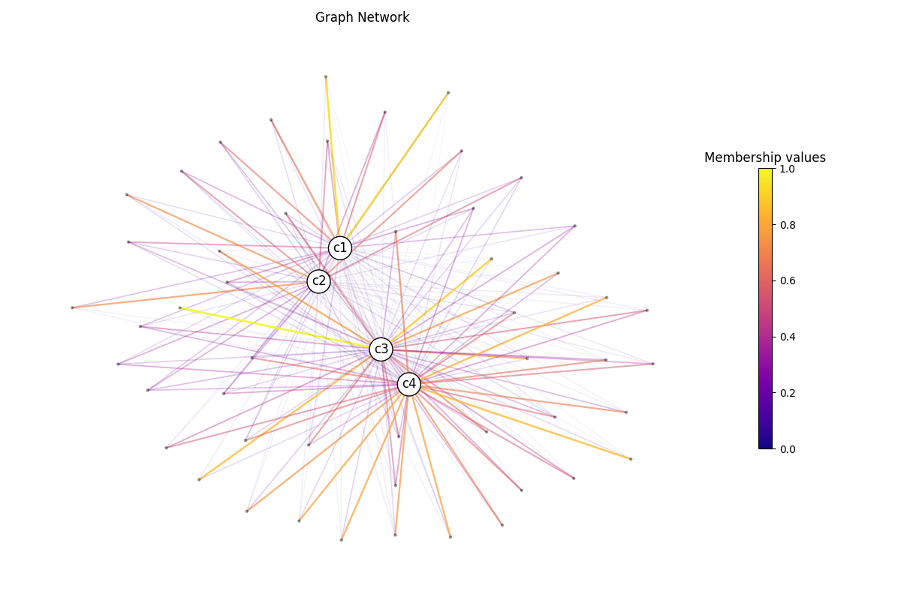

import CommandOutputs from '../../../components/CommandOutputs.astro';

:::caution
The fuzzy clustering API will undergo significant improvements to reflect a structure more
similar to `sklearn`. While this tutorial should work with the current version of
`NeuroStatX`, it might change in the near future.
:::

This tutorial demonstrates how to use the [**`NeuroStatX`**](https://github.com/gagnonanthony/NeuroStatX)
Python package for fuzzy clustering in cognitive-behavioral neuroscience. We'll focus on two use cases:

1. **Projecting new data onto precomputed fuzzy centroids** (e.g., for generalization or replication across cohorts).
2. **Running fuzzy c-means clustering from scratch** to derive data-driven participant profiles (**coming soon**)

For prediction, the initial clustering approach and validation strategies are detailed in our paper:  
> Gagnon, A., Gillet, V., Desautels, A.-S., Lepage, J.-F., Baccarelli, A. A., Posner, J., Descoteaux, M., Brunet, M. A., & Takser, L. (2025). Beyond Discrete Classifications: A Computational Approach to the Continuum of Cognition and Behavior in Children. medRxiv. https://doi.org/10.1101/2025.04.14.25325835

:::note
If you haven't installed `neurostatx` yet, you can do it via `pip`! Or head over to the [installation section](/NeuroStatX/getting-started/installation).
```bash
pip install neurostatx
```
:::

---

### Projecting New Participants to Precomputed Centroids

This is useful when you have:
- Fuzzy centroids already derived on a training set (the centroids from the baseline
Adolescent Brain Cognitive Development baseline follow-up are already shipped with
`NeuroStatX` (Gagnon A _et al._, 2025))
- New participants data with similar features (e.g., cognitive and behavioral scores).

### Why predicting?
Predicting avoids re-fitting clustering and ensures comparability across cohorts.
It is also a major advantage when your population does not have enough subjects
to derive clusters. You then rely on precomputed centroids from large databases
to extract membership values for your new participants.

### Requirements for predicting new data into existing centroids.

While the actual prediction is trivial, there is some mandatory assumptions or
requirements that need to be met in order to obtain acceptable and sound results.

1. If using the centroids from Gagnon A. _et al._ (2025), your data needs to include the
features [`Internalizing`, `Externalizing`, `Stress`, `VA`, `EFPS`, `MEM`] in this specific order.
2. Your data needs to be scaled in order to obtain a mean of 0 with standard deviation of 1. This
step can be performed using `sklearn`.
3. **Optionally**, if you have access to ABCD data, harmonizing your cognitive and behavioral
scores might improve your results.

### Viewing test data

`NeuroStatX` provides a command-line (CLI) tool to predict fuzzy membership values. It also contains
the centroids from the cognitive and behavioral profiles extracted in Gagnon A _et al._ (2025). Let's go through
an example with the `data/example.csv` file. Let's quickly load it in the python console
and look at its structure before using the CLI script.

<CommandOutputs>
<span slot="command">
```python
from neurostatx.io.loader import DatasetLoader

# Load example.csv from the /data folder.
df = DatasetLoader().load_data("data/example.csv")
df.get_data().head(5)
print(df.get_metadata())
```
</span>
<span slot="output">
```python
      ids     Sex   Age       Int       Ext    Stress        VA      EFPS       MEM
0  PC2VLN  Female  10.9  0.853711 -0.155164  0.356608 -0.009190 -0.312745  0.046885
1  XL1LON    Male  11.6  0.712829  0.893640  0.629955  0.446043  0.422631  0.336953
2  F6OQK5    Male  10.7 -0.055407  1.236605  0.501959 -0.657493 -0.451615 -0.343549
3  TJWBKZ    Male  10.3 -0.172911 -1.340310 -0.582634  0.238857 -0.144028 -0.178835
4  KWQW9D    Male  10.8 -0.258481 -0.895303 -0.610380 -0.297869 -0.111272  0.016617
{'nb_subjects': 50, 'nb_variables': 9}
```
</span>
</CommandOutputs>

As you can see, we have 50 subjects with 9 features. The first three features are
descriptive variables representing the ID, sex, and age. The next six features are
our features of interest. As you can see, the `Int` and `Ext` column do not match
our predefined column name, as long they respect the same order, this should not
be a problem for now. Let's try this out and see what comes out.

### Using the CLI script

To test this out, we will use the `PredictFuzzyMembership` CLI script. It already
wraps all commands required to predict membership values for new participants.
First, let's call the help to see which inputs are required.

<CommandOutputs>
<span slot="command">
```bash
PredictFuzzyMembership --help
```
</span>
<span slot="output">
```
Usage: predictfuzzymembership COMMAND [ARGS] [OPTIONS]

╔═══════════════════════════════════════════════════════════════════════════════════════════════════════════════════════════════════════════════════════════════════════════════════════════════════════╗
║                                                                                      Fuzzy Membership Prediction                                                                                      ║
╚═══════════════════════════════════════════════════════════════════════════════════════════════════════════════════════════════════════════════════════════════════════════════════════════════════════╝
This script will predict the membership matrix of a dataset using a trained Cmeans model (only the centroids are necessary for the prediction).

╔═══════════════════════════════════════════════════════════════════════════════════════════════════════════════════════════════════════════════════════════════════════════════════════════════════════╗
║                                                                                            Configurations                                                                                             ║
╚═══════════════════════════════════════════════════════════════════════════════════════════════════════════════════════════════════════════════════════════════════════════════════════════════════════╝
Details regarding the parameters can be seen below. Regarding the --m parameter, it defines the degree of fuzziness of the resulting membership matrix. Using --m 1 will returns crisp clusters, whereas 
--m >1 will returned more and more fuzzy clusters. It is recommended to use the same m value as used during training.

╔═══════════════════════════════════════════════════════════════════════════════════════════════════════════════════════════════════════════════════════════════════════════════════════════════════════╗
║                                                                                             Example Usage                                                                                             ║
╚═══════════════════════════════════════════════════════════════════════════════════════════════════════════════════════════════════════════════════════════════════════════════════════════════════════╝
┌─────────────────────────────────────────────────────────────────────────────────────────────── python ────────────────────────────────────────────────────────────────────────────────────────────────┐
│ PredictFuzzyMembership --in_dataset dataset.xlsx --in_cntr                                                                                                                                            │
│ centroids.xlsx --id_column ID --desc_columns 1 --out_folder                                                                                                                                           │
│ predicted_membership_matrix/ --m 2 --error 1e-6 --maxiter 1000                                                                                                                                        │
│ --metric euclidean --verbose --save_parameters --overwrite                                                                                                                                            │
└───────────────────────────────────────────────────────────────────────────────────────────────────────────────────────────────────────────────────────────────────────────────────────────────────────┘

╭─ Clustering Options ──────────────────────────────────────────────────────────────────────────────────────────────────────────────────────────────────────────────────────────────────────────────────╮
│ M,--m                  Exponentiation value to apply on the membership function, will determined the degree of fuzziness of the membership matrix. [default: 2]                                       │
│ ERROR,--error          Error threshold for convergence stopping criterion. [default: 1e-06]                                                                                                           │
│ MAXITER,--maxiter      Maximum number of iterations to perform. [default: 1000]                                                                                                                       │
│ METRIC,--metric        Metric to use to compute distance between original points and clusters centroids. [choices:                                                                                    │
│                        braycurtis,canberra,chebyshev,cityblock,correlation,cosine,dice,euclidean,hamming,jaccard,jensenshannon,kulczynski1,mahalanobis,matching,minkowski,rogerstanimoto,russellrao,… │
│                        [default: euclidean]                                                                                                                                                           │
│ PCA,--pca              If set, will perform PCA decomposition to 3 components before clustering. [default: False]                                                                                     │
│ PCA-MODEL,--pca-model  If set, will load a pre-trained PCA model to apply on the dataset. [default: None]                                                                                             │
╰───────────────────────────────────────────────────────────────────────────────────────────────────────────────────────────────────────────────────────────────────────────────────────────────────────╯
╭─ Commands ────────────────────────────────────────────────────────────────────────────────────────────────────────────────────────────────────────────────────────────────────────────────────────────╮
│ --help,-h  Display this message and exit.                                                                                                                                                             │
│ --version  Display application version.                                                                                                                                                               │
╰───────────────────────────────────────────────────────────────────────────────────────────────────────────────────────────────────────────────────────────────────────────────────────────────────────╯
╭─ Essential Files Options ─────────────────────────────────────────────────────────────────────────────────────────────────────────────────────────────────────────────────────────────────────────────╮
│ *  IN-DATASET,--in-dataset      Input dataset. [required]                                                                                                                                             │
│ *  IN-CNTR,--in-cntr            Centroid file to use for prediction. Should come from a trained Cmeans model (such as FuzzyClustering). [required]                                                    │
│ *  ID-COLUMN,--id-column        Name of the column containing the subject's ID tag. Required for proper handling of IDs and merging multiple datasets. [required]                                     │
│ *  DESC-COLUMNS,--desc-columns  Number of descriptive columns at the beginning of the dataset to exclude in statistics and descriptive tables. [required]                                             │
│    OUT-FOLDER,--out-folder      Output folder for the predicted membership matrix.                                                                                                                    │
╰───────────────────────────────────────────────────────────────────────────────────────────────────────────────────────────────────────────────────────────────────────────────────────────────────────╯
╭─ Optional parameters ─────────────────────────────────────────────────────────────────────────────────────────────────────────────────────────────────────────────────────────────────────────────────╮
│ V  -v  If true, produce verbose output. [default: False]                                                                                                                                              │
│ S  -s  If true, will save input parameters to .txt file. [default: False]                                                                                                                             │
│ F  -f  If true, force overwriting of existing output files. [default: False]                                                                                                                          │
╰───────────────────────────────────────────────────────────────────────────────────────────────────────────────────────────────────────────────────────────────────────────────────────────────────────╯
╭─ Visualization Options ───────────────────────────────────────────────────────────────────────────────────────────────────────────────────────────────────────────────────────────────────────────────╮
│ PARALLELPLOT,--parallelplot  If true, will output parallel plot for each cluster solution. Default is False. [default: False]                                                                         │
│ RADARPLOT,--radarplot        If true, will output radar plot for each cluster solution. Default is True. [default: True]                                                                              │
│ CMAP,--cmap                  Colormap to use for plotting. Default is "magma". See Matplotlib (https://matplotlib.org/stable/tutorials/colors/colormaps.html). [default: magma]                       │
╰───────────────────────────────────────────────────────────────────────────────────────────────────────────────────────────────────────────────────────────────────────────────────────────────────────╯
```
</span>
</CommandOutputs>

We can see from the script's help that only those files are required:

1. Input dataset.
1. Centroids.
1. Name of the column containing subject IDs.
1. Number of descriptive columns to ignore at the beginning of the dataset.

However, feature reduction was performed prior to clustering in Gagnon A _et al._ (2025).
The `NeuroStatX` also provides the loadings for this PCA model, we need to supply it
at runtime to ensure the same feature reduction is also performed on our new subjects.

Now, let's truly test this out with the `data/example.csv` dataset (keep in mind,
the name of the columns do not match the required naming.)

<CommandOutputs>
<span slot="command">
```bash
PredictFuzzyMembership \
    --in-dataset data/example.csv \
    --in-cntr data/GagnonA_2025_centroids.xlsx \
    --id-column ids \
    --desc-columns 3 \
    --pca \
    --pca-model data/GagnonA_2025_pca.pkl \
    --out-folder testPredictFuzzy/ \
    -v -s -f
```
</span>
<span slot="output">
```bash
2025-06-26 15:29:27 Anthonys-MacBook-Pro-2.local root[47854] INFO Loading dataset(s)...
2025-06-26 15:29:27 Anthonys-MacBook-Pro-2.local root[47854] INFO Loading PCA model...
2025-06-26 15:29:27 Anthonys-MacBook-Pro-2.local root[47854] INFO Predicting membership matrix...
2025-06-26 15:29:27 Anthonys-MacBook-Pro-2.local root[47854] INFO Saving results...
```
</span>
</CommandOutputs>

**Your new subjects have been successfully projected in the profile space of Gagnon A. _et al._ (2025)!**
Let's inspect the results. You can find them in the `testPredictFuzzy/` folder.

### Radar plot

One interesting way to visualize clustering results is using a radar plot. Those are automatically
generated when you predict new data. Here is the one from our earlier prediction.



We can see they reproduce the findings from the original paper! That is exactly what we want.
Let's now view the results using a graph network.

### Constructing a graph network

To do this, let's head back into the python console and inspect our new membership values.

<CommandOutputs>
<span slot="command">
```python
from neurostatx.io.loader import DatasetLoader

# Load the output from the previous script.
df = DatasetLoader().load_data("testPredictFuzzy/predicted_membership_matrix.xlsx")
df.get_data().head(5)
```
</span>
<span slot="output">
```csv
      ids     Sex   Age       Int       Ext    Stress        VA      EFPS       MEM  Cluster #1  Cluster #2  Cluster #3  Cluster #4
0  PC2VLN  Female  10.9  0.853711 -0.155164  0.356608 -0.009190 -0.312745  0.046885    0.650611    0.126757    0.103559    0.119073
1  XL1LON    Male  11.6  0.712829  0.893640  0.629955  0.446043  0.422631  0.336953    0.379016    0.439541    0.104214    0.077230
2  F6OQK5    Male  10.7 -0.055407  1.236605  0.501959 -0.657493 -0.451615 -0.343549    0.136026    0.665600    0.076213    0.122161
3  TJWBKZ    Male  10.3 -0.172911 -1.340310 -0.582634  0.238857 -0.144028 -0.178835    0.090768    0.064187    0.426084    0.418961
4  KWQW9D    Male  10.8 -0.258481 -0.895303 -0.610380 -0.297869 -0.111272  0.016617    0.050047    0.039926    0.265102    0.644925
```
</span>
</CommandOutputs>

We can see that the membership values for our four clusters have been appended to the original dataframe!
We can use those membership values to build our graph network. Let's leverage additional
`NeuroStatX` function to do so. Most of those functions have been explained in the [Introduction to NeuroStatX](/NeuroStatX/tutorials/intro)
section.

<CommandOutputs>
<span slot="command">
```python
from neurostatx.io.loader import GraphLoader
from neurostatx.network.utils import get_nodes_and_edges

# Let's drop the descriptive column and original scores.
df.drop_columns([i for i in range(1,9)])

# Let's now construct pairs of subject-centroid nodes.
pairs, _, _ = df.custom_function(
    get_nodes_and_edges
)

# Now build our graph.
G = GraphLoader().build_graph(
    pairs,
    "node1",
    "node2",
    edge_attr="membership"
)

# Compute the layout.
G.layout(weight="membership")

# Let's view this graph.
G.visualize(
    "predictedsubjects.png",
    weight="membership",
    edge_width_multiplier=1
    )
```
</span>
</CommandOutputs>



There you go! Obviously, the layout is different than the one presented in
Gagnon A. _et al._ (2025) since we have much less subjects. You are now ready to
use those membership values in your statistical analysis!

### Performing fuzzy clustering from scratch

:::caution
This section will come once the new API has been merged. **Stay tuned!**
:::